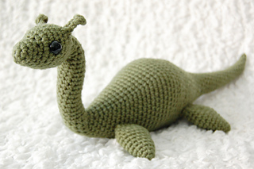

# Homepage

## Hello!
My name is **Melody**, and I am a second-year _computer science_ major at UCSD.

## What do I do?

Here are a few topics I'm interested in within computer science:
- Embedded systems
- Low-power computing
- Machine learning

But of course I am always looking to explore new things!

I'm involved in a few other things within the CSE department, other than classes.
1. Undergraduate research
2. Running a programming competition through Women In Computing
3. Tutoring! Starting this quarter

This page was made with Github Pages, using commands like
```
git branch
git add
git commit
git push
```

## Me, the person
In my free time, when I have it, I like to crochet.

Here is one of the things I've made recently (not my own picture!)



If you are interested in making Nessie, check out the [pattern here](https://www.ravelry.com/patterns/library/nessie-4).

The creator's tagline for this pattern:
> Crochet yourself a soft and cuddly Loch Ness monster! 

Some things you will need to make this pattern:
- [ ] a crochet hook
- [ ] yarn
- [ ] safety eyes
- [ ] tapestry needle
- [ ] pipe cleaners or other thin wire
- [x] great taste in crochet patterns

One thing I like is that this pattern only needs 1 color of yarn, so it's harder for the yarn to end up like this [stressful, tangled mess](yarn.jpg).